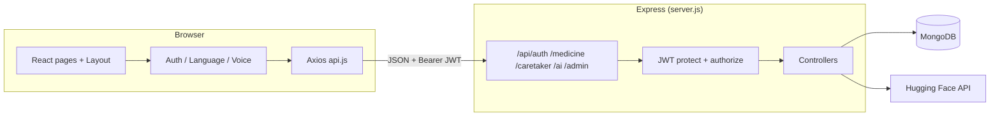

# Med-Mate — Project structure & how everything works

This document explains how the **Med-Mate** full-stack app is organized so you can **study it, present it, and answer questions** confidently.

---

## 1. What is Med-Mate?

A **medicine management** web app with:

- **Patients**: track medicines, history, AI tips, profile.
- **Caretakers**: manage **assigned patients**, add medicines for them, add new patients (verified accounts), call patients (`tel:`).
- **Admins**: view system stats, caretaker lists, patient–medicine overview, **assign unassigned patients** to caretakers.

All **business data** (users, medicines, auth) lives in the **backend** (MongoDB + Express). The **React** app is the UI; it does not replace the server for persistence.

---

## 2. Tech stack

| Layer | Technology |
|--------|------------|
| Frontend | React 19, Vite 7, React Router 7, Tailwind CSS 4, Axios, Framer Motion, Lucide icons |
| Backend | Node.js, Express 5, Mongoose (MongoDB), JWT, bcryptjs, Nodemailer (email flows) |
| AI (optional) | Hugging Face Router API (`HUGGINGFACE_API_TOKEN`) for suggestions + chat |

---

## 3. Repository layout

```
med-mate/
├── src/                    # React frontend
│   ├── App.jsx             # Routes, providers, role guards
│   ├── main.jsx            # React root
│   ├── index.css           # Global styles (incl. themed scrollbar)
│   ├── layouts/Layout.jsx  # Sidebar / bottom nav, voice mic (logged-in)
│   ├── pages/              # One file per main screen
│   ├── components/         # Reusable UI (e.g. CountryPhonePicker, Voice*)
│   ├── context/            # Auth, Language, Voice
│   ├── hooks/              # useVoiceCommands
│   └── utils/
│       ├── api.js          # Axios instance → backend (JWT attached)
│       └── voiceCommands.js + voiceCommandExecutor.js
├── public/
│   └── favicon.svg         # App favicon
├── backend/
│   ├── server.js           # Express app entry, mounts `/api/*`
│   ├── config/db.js        # MongoDB connection (MONGO_URI)
│   ├── models/             # User, Medicine (Mongoose)
│   ├── routes/             # auth, medicine, caretaker, ai, admin
│   ├── controllers/        # Route handlers
│   └── middleware/
│       └── authMiddleware.js  # JWT `protect` + role `authorize`
├── .env.example            # Frontend env template (VITE_API_URL)
└── backend/.env.example    # Backend env template
```

---

## 4. Does the whole system run from the backend?

**Yes, for data and security.**

- Every **API call** from the app goes through **`src/utils/api.js`** (Axios).
- The client sends **`Authorization: Bearer <token>`** on each request (token from `localStorage` key `med_mate_token`).
- **No other HTTP client** is used for app data in `src/` (no hard-coded duplicate APIs).

**Backend URL**

- Default: **`http://localhost:5000/api`** (matches `backend/server.js`: `PORT` from env or **5000**).
- Override: set **`VITE_API_URL`** in a **root** `.env` file (see `.env.example`).

**Important:** If your `backend/.env` uses another port (e.g. `5001`), either change `PORT` to **5000** or set `VITE_API_URL=http://localhost:5001/api` in the frontend `.env`.

---

## 5. Backend API map (what the frontend calls)

| Area | Method | Path | Who | Purpose |
|------|--------|------|-----|---------|
| Auth | POST | `/api/auth/signup` | Public | Register |
| Auth | POST | `/api/auth/verify-email` | Public | Verify code |
| Auth | POST | `/api/auth/resend-code` | Public | Resend code |
| Auth | POST | `/api/auth/login` | Public | Login → JWT |
| Auth | POST | `/api/auth/forgotpassword` | Public | Start reset |
| Auth | POST | `/api/auth/verify-reset-code` | Public | Verify reset code |
| Auth | PUT | `/api/auth/resetpassword` | Public | New password |
| Auth | PUT | `/api/auth/profile` | Private | Update name |
| Auth | PUT | `/api/auth/password` | Private | Change password |
| Medicine | GET/POST | `/api/medicine` | patient, caretaker | List / add (`patientId` for caretaker) |
| Medicine | PUT/DELETE | `/api/medicine/:id` | patient, caretaker | Update / delete |
| Caretaker | GET | `/api/caretaker/patients` | caretaker | List patients |
| Caretaker | POST | `/api/caretaker/add-patient` | caretaker | Create patient user |
| AI | GET | `/api/ai/suggestions` | patient, caretaker | AI suggestions from meds |
| AI | POST | `/api/ai/chat` | patient, caretaker | Chat completion |
| Admin | GET | `/api/admin/stats` | admin | Dashboard counts |
| Admin | GET | `/api/admin/caretakers` | admin | Caretakers + assignment counts |
| Admin | GET | `/api/admin/unassigned-patients` | admin | Patients without caretaker |
| Admin | GET | `/api/admin/patients-medicines` | admin | Patients + meds + caretaker |
| Admin | PUT | `/api/admin/assign-patient` | admin | Assign patient → caretaker |

Routes under `/api/medicine`, `/api/caretaker`, `/api/ai`, `/api/admin` use **`protect`** (valid JWT) and **`authorize(...roles)`** where needed.

---

## 6. Authentication & roles (end-to-end)

1. **Login** → `POST /api/auth/login` → server returns **JWT** + user object.
2. **AuthContext** stores user in React state and **`localStorage`** (`med_mate_user`, `med_mate_token`).
3. **Axios interceptor** (`api.js`) attaches `Authorization: Bearer <token>`.
4. **ProtectedRoute** (in `App.jsx`): if not authenticated → redirect **`/login`**.
5. **RoleRoute**: if role not in `allowedRoles` → redirect **`/`**.
6. **RoleBasedDashboard**: **`admin`** → `AdminDashboard`, **`caretaker`** → `CaretakerDashboard`, else **`Dashboard`** (patient).

**User model (`backend/models/User.js`)** highlights:

- `role`: `patient` | `caretaker` | `admin`
- `caretaker`: ObjectId → assigned caretaker (for patients)
- `isVerified`, email verification fields, password hashed with **bcrypt** on save

---

## 7. Feature-by-feature (how each part works)

### 7.1 Sign up & email verification

- **Page:** `Signup.jsx` → `AuthContext.signup` → **`POST /api/auth/signup`**.
- User may need to **`/verify-email`** with code → **`POST /api/auth/verify-email`**.

### 7.2 Login / logout

- **Login.jsx** → **`POST /api/auth/login`** → navigate `/`.
- **Logout:** clears user + tokens (`AuthContext.logout`); voice can also trigger logout via `useVoiceCommands`.

### 7.3 Forgot / reset password

- **ForgotPassword.jsx** / **ResetPassword.jsx** → corresponding **`/api/auth/*`** endpoints.

### 7.4 Patient dashboard (`Dashboard.jsx`)

- Loads medicines via **`GET /api/medicine`** (query is “own user” on server).
- UI shows schedule / status; updates use **`PUT /api/medicine/:id`** (e.g. mark taken).

### 7.5 Add medicine (`AddMedicine.jsx`)

- **`POST /api/medicine`** with name, dosage, time, type, etc.
- **Caretaker** must send **`patientId`**; server checks that patient’s `caretaker` matches logged-in caretaker.

### 7.6 History (`History.jsx`)

- Uses **`GET /api/medicine`** (and/or client-side filtering depending on implementation) to show past / completed style views — still **same API**, data from DB.

### 7.7 Caretaker dashboard (`CaretakerDashboard.jsx`)

- **Patients:** **`GET /api/caretaker/patients`**.
- **Medicines:** **`GET /api/medicine?patientId=...`** when a patient chip is selected.
- **Add patient modal:** **`POST /api/caretaker/add-patient`**; URL can use `/?addPatient=true` for deep link + voice.
- **Call patient:** `tel:` link from stored `phoneNumber`.

### 7.8 Admin dashboard (`AdminDashboard.jsx`)

- Parallel **`GET`**s: stats, caretakers, unassigned, patients-medicines.
- **Assign:** **`PUT /api/admin/assign-patient`** with `patientId` + `caretakerId`.
- **Voice:** sections have HTML `id`s (`admin-overview`, `admin-caretakers`, etc.) for scroll; **refresh** triggers reload via `med-mate-voice` event.

### 7.9 AI suggestions & chat (`AISuggestions.jsx`)

- **Suggestions:** **`GET /api/ai/suggestions`** → backend loads **`Medicine.find({ user: req.user.id })`**, builds prompt, calls **Hugging Face**; returns JSON list for UI cards.
- **Chat:** **`POST /api/ai/chat`** with message + history.
- **Note:** Today, AI context uses medicines for the **logged-in user id**. A **caretaker** account may have **no medicines on their own user document**, so suggestions/chat context may be empty unless extended to a selected patient (worth mentioning in Q&A).

### 7.10 Profile (`Profile.jsx`)

- Name / password updates → **`PUT /api/auth/profile`** and **`PUT /api/auth/password`**.
- Language toggle, notifications UI, privacy modal — mostly client-side except profile API calls.
- Listens for **`med-mate-voice`** for “edit name / password / privacy” and closing modals.

### 7.11 Internationalization (EN / UR)

- **`LanguageContext.jsx`**: large string maps `en` / `ur`, `toggleLanguage`, persistence (e.g. `localStorage` key for language).
- **`Layout.jsx`** sets `dir="rtl"` for Urdu.
- Voice recognition language follows UI language (`en-US` vs `ur-PK`) in **`useVoiceCommands`**.

### 7.12 Voice commands

- **`matchVoiceCommand`** (`voiceCommands.js`): maps speech text → action type (navigate, logout, toggle language, scroll, open AI chat, etc.).
- **`executeVoiceCommand`** (`voiceCommandExecutor.js`): runs navigation / logout / dispatches **`med-mate-voice`** for page-specific behavior.
- **Invalid command:** **`emitVoiceToast`** → **`VoiceCommandToast.jsx`** (no TTS for errors).
- **Auth pages:** **`VoiceFloatingAuth.jsx`** (mic without Layout). **Logged-in:** mic in **Layout**.

### 7.13 UI shell (`Layout.jsx`)

- **Desktop:** glass sidebar + nav links (role-dependent) + “Add medicine” CTA (non-admin).
- **Mobile:** bottom nav + center FAB to `/add`.
- **Caretaker:** extra “Add patient” link with query `/?addPatient=true`.

---

## 8. Data models (MongoDB)

### User

- Identity: name, email, password (hashed), DOB, gender, phone, role, `caretaker` ref, verification fields.

### Medicine

- Linked to **`user`** (the **patient** who owns the schedule): `name`, `dosage`, `time`, `type`, **`status`** (`Pending` | `Taken` in schema), timestamps.

Medicines are **always stored against the patient user**; caretakers access them only through server-side checks (`userCanAccessMedicine`, `patientId` on add).

---

## 9. High-level architecture diagram



---

## 10. How to run locally (checklist)

1. **MongoDB** running; set **`MONGO_URI`** and **`JWT_SECRET`** in `backend/.env` (see `backend/.env.example`).
2. **Backend:** `cd backend && npm install && npm run dev` (or `npm start`) → listen on **`PORT`** (default **5000**).
3. **Frontend:** from repo root `npm install && npm run dev` (Vite dev server).
4. If backend port ≠ 5000, set **`VITE_API_URL`** in root `.env` to `http://localhost:<PORT>/api`.
5. For AI: set **`HUGGINGFACE_API_TOKEN`** in `backend/.env`.

---

## 11. Presentation / Q&A cheat sheet

| Question | Short answer |
|----------|----------------|
| Where is data stored? | **MongoDB**, via **Express API**. |
| How is the user kept logged in? | **JWT** in `localStorage`; Axios sends it on every request. |
| How do roles work? | **`user.role`** on the server; **`authorize`** middleware + React **`RoleRoute`**. |
| Can caretakers see any patient? | **No** — only patients whose **`caretaker`** field matches them; enforced in controllers. |
| Is the frontend only UI? | For persistence and auth, **yes**; it also has **voice**, **i18n**, and **routing** logic. |
| What is the favicon? | **`public/favicon.svg`** — teal gradient + medical cross; linked from **`index.html`**. |
| Production API URL? | Build frontend with **`VITE_API_URL`** pointing to your deployed API. |

---

## 12. Files worth opening first (onboarding)

1. `src/App.jsx` — all routes and guards  
2. `src/utils/api.js` — backend base URL + JWT  
3. `backend/server.js` — route mounting  
4. `backend/middleware/authMiddleware.js` — JWT + roles  
5. `src/context/AuthContext.jsx` — login state + API wrappers  
6. `backend/controllers/medicineController.js` — patient vs caretaker rules  

---

*Generated as a living overview of the Med-Mate codebase. Update this file when you add routes, roles, or major features.*
